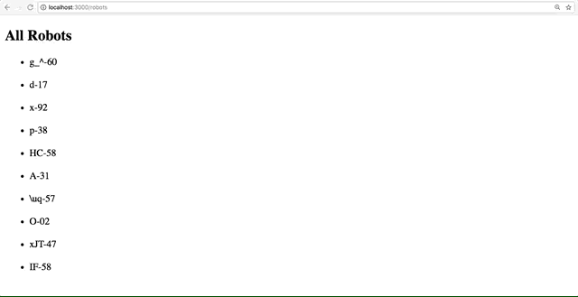

# Rails Code Challenge Assessment

## Objectives (what we're assessing)

* MVC
* REST
* Request/Response Cycle
* Form/Form Helpers
* ActiveRecord
* Validations

## Setup

Before you begin, fork and clone this repo, run `bundle install` and `rake db:migrate` to get started.

## The Domain

Congrats! You've been hired by ***WeBotsltd*** to help track the way they outfit their variety of robots. The company has decided to create a rails app where a user can create Robots and assign one of many functions to each.

Your teammate has already started work on the site. They've added a `Robot` model and an `Ability` model, and set up a `seeds.rb` file to reflect the initial state of the company's inventory. However, the relationship between these models has not been established. Each ability can be bestowed upon ***more than one robot***, and each robot has ***one ability***.

Once you've set up the relationship between models and seeded the database, you can visit `/robots` to display the existing Robots, and `/abilities` to display Abilities.

## Instructions / Deliverables

Read through the instructions to get a sense of the scope of this code challenge, and then tackle them one by one.

1. Create the associations between models. You may have to alter the current schema to get your code working. If you've set up your relationships properly, you should be able to run `rake db:seed` without errors, and confirm in console that the robots and abilities have been created with the proper relations.

2. On the robots index page, a robot's name should link to the robot's show page.

3. The robot show page should include the robot's name (eg. d-17), an image (via `image_url`), and its ability. The ability should link to the ability show page.  

4. The ability show page should have its name and description.

5. As a visitor to the website, I should be able to create a new robot with a name. The `image_url` will be generated automatically.

6. The form should also allow each robot to be created with **only one of the existing abilities**.

7. Make sure no two robots have the same name.

8. Add a filter to the index view of the robots. This will allow the visitor to search for an existing robots and display all the robots whose name contains the search term.

### Hints / Tips
+ Draw your domain model and associations before you begin. You may have to alter the current schema to get your code working.
+ A child model cannot be persisted without being associated with its parent model.
+ More than one robot can have the same ability.
+ We want to be RESTful. What URL should show info about a particular robot? What URL should show a form to create a robot? What controller actions are associated?
+ If you're having a hard time implementing the filter, take a look at this http://guides.rubyonrails.org/form_helpers.html#a-generic-search-form. We are asking an input field to search for robots.
